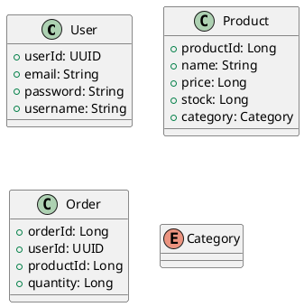

# 제품 관리 프로젝트

## 도메인 모델 설계

```plantuml
@startuml

class User {
    + userId: UUID
    + email: String
    + password: String
    + username: String

}

class Product {
    + productId: Long
    + name: String
    + price: Long
    + stock: Long
    + category: Category
}

class Order {
    + orderId: Long
    + userId: UUID
    + productId: Long
    + quantity: Long
}

enum Category {

}

@enduml
```
